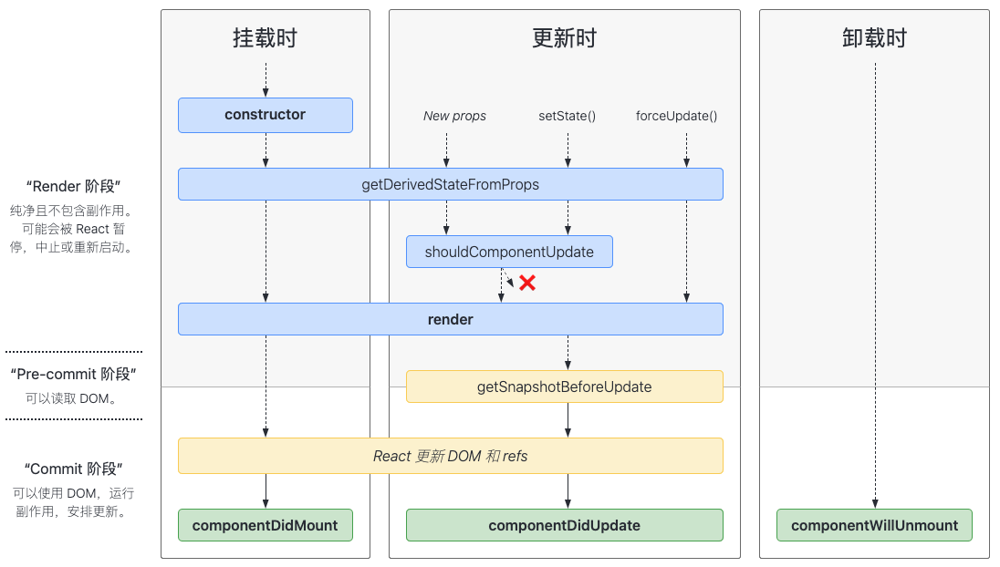
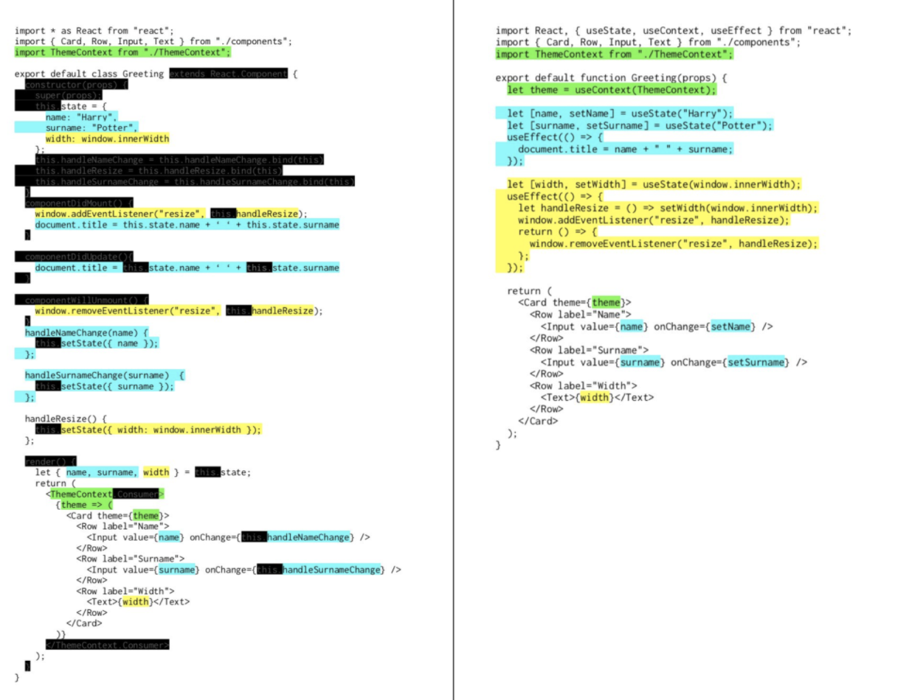

## react

## class组件中生命周期 [中文文档](https://zh-hans.reactjs.org/docs/react-component.html#constructor)



- Mounting
  - `constructor()`  在 React 组件挂载之前，会调用它的构造函数
  - `static getDerivedStateFromProps()` 在调用 render 方法之前调用，并且在初始挂载及后续更新时都会被调用。它应返回一个对象来更新 state，如果返回 null 则不更新任何内容。
  - `render()`  是class 组件中唯一必须实现的方法。返回一段jsx视图内容
  - `componentDidMount()` 在组件挂载后（插入 DOM 树中）立即调用
- Updating
  - `static getDerivedStateFromProps()`
  - `shouldComponentUpdate()` 判断 React 组件的输出是否受当前 state 或 props 更改的影响;默认行为是 state 每次发生变化组件都会重新渲染。
  - r`ender()`
  - `getSnapshotBeforeUpdate()`  在最近一次渲染输出（提交到 DOM 节点）之前调用
  - `componentDidUpdate()` 在更新后会被立即调用
- Unmounting
  - `componentWillUnmount()` 在组件卸载及销毁之前直接调用

- 错误处理：
  - `static getDerivedStateFromError()`  会在后代组件抛出错误后被调用
  - `componentDidCatch()`  在后代组件抛出错误后被调用


Hooks:
    就是把某个目标结果钩到某个可能会变化的数据原或者事件源上，那么当被钩到的数据或者事件发生变化时，产生这个目标的代码会重新执行，产生更新后的结果

## class与hook

- react组件间不会相会继承的。不是不能用只是不推荐这样做，继承会让两个组件紧密耦合在一起，不太利于维护和逻辑复用。

- 因为所有的UI都是有状态驱动的，因此很少会在外部去调用一个类实例的方法；组件的所有方法都是在内部调用，或者作为生命周期方法被自动调用。

- 方便逻辑复用；在之前的class组件中要想逻辑复用就必须使用高阶组件等复杂的设计模式，而且高阶组件还会产生冗余的组件节点。

- 逻辑解藕；class组件中，不得不把同一个业务逻辑的代码分散在类组件的不同生命周期的方法中，而`hooks`则可以把业务逻辑清晰的隔开，让代码更加容易理解和维护

- class组件与函数组件的对比图：

  
  图的左侧是 Class 组件，右侧是函数组件结合 Hooks。蓝色和黄色代表不同的业务功能。可以看到，在 Class 组件中，代码是从技术角度组织在一起的，例如在 componentDidMount 中都去做一些初始化的事情。而在函数组件中，代码是从业务角度组织在一起的，相关代码能够出现在集中的地方，从而更容易理解和维护。

## 使用hooks的规则

- 只能在函数组件的顶级作用域使用；所谓顶层作用域就是不能在循环、条件判断、嵌套函数内使用。
- 只能在函数组件或者其他hooks中使用；一种是在函数内，另一种则是自定义的hooks内使用
  

## useState

> 让函数组建具有维持状态的能力，也就是说在一个函数组建的多次渲染之间，这个state是共享的

- `useState()`返回一个数组，数组中包含两个元素；第一个是初始化时的值，可以为任意类型；第二个是修改当前state的方法。

```jsx
import React, { useState } from 'react';
function Counter() { 
    // 创建一个保存 count 的 state，并给初始值 0 
    const [count, setCount] = useState(0); 
    return (
        <div>
            <p>{count}</p>
            <button onClick={()=>setCount(count+1)}>+</button>
        </div>
    )
}

export default Counter
```

- 如果要创建多个state，就需要多次调用`useState()`

```jsx
// 声明多个state
const [age, setAge] = useState(22)
const [fruit, setFruit] = useState('bannana')
const [isDone, setIsDone] = useState(false)
```

> Tips:
> 我们要遵循一个原则：**state中用于不要保存可以通过计算得到的值**
> 比如：

- 从`props`传递过来的值，有时候`props`传递过来的值无法直接使用，而是要通过一定的计算后再在UI上展示，比如说排序。那么我们要做的就是每次使用的时候重新排序一下或者利用某些cache机制，而不是将结果直接放到state里
- 从URL中读到的值。比如有时需要读取URL中的参数，把它作为组建的一部分；那么我们可以每次使用的时候从URL中读取，而不是读出来直接放到state里
- 从`cookie`、`localStorage`中读取的值。通常来说，也是每次要用的时候直接去读取，而不是读出来后放到state里


## useEffect：执行副作用

副作用是指一段和当前执行结果无关的代码。比如说要修改函数外部的某个变量，要发起一个请求等等，也就是说`useEffect`中代码的执行是不影响渲染出来的UI

### 基本用法

useEffect接收两个参数

```jsx
useEffect(callback, dependencies)
```

- 第一个为执行函数callback
- 第二个为可选的依赖项数组dependencies；依赖项是可选的，如果不传如的话，callback就会在每次函数组建执行完后都执行；如果指定了，就只有依赖项中的值发生变化的时候才会执行

**`useEffect`是每次组建`render`完后判断依赖并执行**

示例：展示文章的组件，组件接收一个文章的id，当id放生变化时，组件就发起请求来获取文章内容；

```jsx
import React, { useEffect, useState } from 'react'

const Article = (id) => {
    // 初始化变量保存内容
    const [content, setContent] = useState(null)
    
    useEffect(()=>{
        // useEffect的callback要避免直接的async函数，需要封装一下
        const doAsync = async () => {
            // 当id发生变化时，将当前内容清除以保持一致性
            setContent(null)

            // 发起请求获取数据
            const result = await fetch(`/content/${id}`)

            // 将获取到的数据放入content中
            setContent(result.data)
        }

        doAsync()
    }, [id]) // 使用id作为依赖项，变化时则执行副作用

    const isLoading = !content
    return (
        <div>{isLoading?"loading……":content}</div>
    )
}

export default Article
```

useEffect的特殊用法：

  - 没有依赖项，则每次`render`都会重新执行。

  ```jsx
  useEffect(()=>{
      // 每次render完执行一次
      console.log('re-rendered')
  })
  ```

  - 空数组作为依赖项，则只要在首次执行时触发，对应到`calss`组件中的生命周期就是`componentDidMount`

  ```jsx
useEffect(()=>{
    // 组件首次渲染时执行，等价于class组件生命周期中的componnetDidMount
}, [])
  ```

  - `useEffect`还允许你返回一个函数，用于在组件销毁的时候做一些清理的操作。比如移除事件监听、清理定时器等等；相当于`class`组件生命周期中`componentWillUnmount`

  ```jsx
    import { useEffect, useState } from 'react'

    const WindowSize = () => {
        const [size, setSize] = useState(window.innerWidth)

        const getSize = () => window.innerWidth

        useEffect(()=>{
            // 窗口大小变化事件处理函数
            const handler = () => {
                setSize(getSize())
            }

            // 监听resize事件
            window.addEventListener('resize', handler)

            // 返回一个callback在组件销毁时调用
            return () => {
                // 移除resize事件
                window.removeEventListener('resize', handler)
            }
        }, [size])

        return (
            <>
                {size} 
            </>
        )
    }

    export default WindowSize
  ```

> `useEffect`让我们能够在下面四种时机去执行一个回调函数产生副作用：
>
> - 每次`render`后执行：不提供第二个参数；比如：`useEffect(()=>{})`
> - 仅第一次`render`后执行：提供一个空数组作为依赖项；比如：`useEffect(()=>{}, [])`
> - 第一次以及依赖项发生变化后执行：提供依赖项数组；比如：`useEffect(()=>{}, [deps])`
> - 组件unmount后执行：返回一个回调；比如：`useEffect(()=>{ return ()=>{}}, [])`

Hooks提供了让你监听某个数据变化的能力；这个变化可能会触发组件的刷新，也可能是去创建一个副作用，又或是刷新一个缓存；那么定义要监听那些数据变化的机制，其实就是指定Hooks的依赖项

> Tips: 定义依赖项时，我们需要注意以下事项
>
> - 依赖项中定义的变量是会在回调函数中用到的，否则声明依赖项其实是没有意义的
>   依赖项一般是一个常量数组，而不是一个变量；因为一般在创建callback的时候，你其实非常清楚其中要用到那些依赖项
>   React会使用浅比较来对比依赖项是否发生了变化，所以要特别注意数组或者对象类型；如果你是每次创建一个新对象，即使和之前的值等价，也会被认为是依赖项发生了变化。这是一个刚开始使用hooks时很容易导致Bug的地方

```jsx
function Sample() { 
    // 这里在每次组件执行时创建了一个新数组 
    const todos = [{ text: 'Learn hooks.'}]; 
    useEffect(() => { 
        console.log('Todos changed.'); 
    }, [todos]);
}
```

代码的原意可能是在 todos 变化的时候去产生一些副作用，但是这里的 todos 变量是在函数内创建的，实际上每次都产生了一个新数组。所以在作为依赖项的时候进行引用的比较，实际上被认为是发生了变化的。

## useCallback：缓存回调函数

### 语法：

```jsx
useCallback(fn, deps)
```

- fn是定义的回调函数
- deps是依赖的变量数组，只有当某个依赖变量发生变化时才会重新声明fn这个回调函数

### 使用场景：

比如下面的代码中，我们在加号按钮上定义了一个事件处理函数，用来让计数器加 1。但是因为定义是在函数组件内部，因此在多次渲染之间，是无法重用 handleIncrement 这个函数的，而是每次都需要创建一个新的：

```jsx
function Counter() {     const [count, setCount] = useState(0);     const handleIncrement = () => setCount(count + 1);     // ...     return <button onClick={handleIncrement}>+</button>}
```

> 每次组件状态发生变化的时候，函数组件实际上都会重新执行一遍；在每次执行的时候，实际上都会创建一个新的事件处理函数`handleIncrement`，这个事件处理函数中包含了count这个变量的闭包，以确保每次能够得到正确的结果，这也意味着即使count没有发生变化，但是函数组件因为其他状态发生变化而重新渲染时，这种写法也会每次创建一个新的函数，创建一个新的事件处理函数，虽然不影响结果的正确性，但其实没必要的；因为这样做不仅增加了系统的开销，更重要的是每次创建新函数的方式会让接收事件处理函数的组件需要重新渲染。


优化：当count发生变化的时候才重新定一个回调函数，这也正是`useCallback`这个hook的作用

```jsx
import React, { useCallback, useState } from 'react'const Counter = () => {    const [count, setCount] = useState(0)    const handleIncrement = useCallback(()=>{        setCount(count + 1)    }, [count])    return (        <div>            <p>{count}</p>            <button onClick={handleIncrement}>+</button>        </div>    )}
```

> 这儿将count作为一个依赖传递给`useCallback`，只有count发生变化的时候才需要重新创建一个回调，这样就保证了组件不会创建重复的回调函数；而是接收这个回调函数作为属性的组件，也不会频繁地需要重新渲染；除了`useCallback`， `useMemo`也是为了缓存而设计的，只不过`useCallback`缓存函数，而`useMemo`缓存的是计算的结果。

## useMemo：缓存计算的结果

### 语法

```jsx
useMemo(fn, deps)
```

- `fn`是产生所需数据的一个计算函数，通常来说，`fn`会使用`deps`中声明的一些变量来生成一个结果，用来渲染出最终的UI

> 如果某个数据是荣国其他数据得到的，那么只有当用到的数据，也就是依赖的数据发生变化的时候，才需要重新计算

### 使用场景

一个显示用户信息的列表，现在需要对用户名进行搜索，且UI上需要根据搜索关键字显示过滤后的用户，那么这样一个功能需要有两个状态：

- 用户列表数据本身：来自某个请求
- 搜索关键字：用户在搜索框输入的数据

无论两个数据中的哪一个发生变化，搜需要过滤用户列表以获取需要展示的数据，不实用`useMemo`的话，实现如下：

```jsx
import React, { useEffect, useMemo, useState } from 'react'

const List = () => {
    const [users, setUsers] = useState(null)
    const [searchKey, setSearchKey] = useState('')

    useEffect(()=>{
        const doFetch = async () => {
            const result = await fetch('https://reqres.in/api/users')
            setUsers(await result.json())
        }
        doFetch()
    }, [])

    let usersToShow = []

    if(users){
        usersToShow = users.data.filter(user => user.first_name.includes(searchKey))
    }
    

    return (
        <div>
            <input type="text" value={searchKey} onChange={(e) => setSearchKey(e.target.value)} />

            <ul>
                {
                    usersToShow && usersToShow.length > 0 && usersToShow.map(user => {
                        return <li key={user.id}>{user.first_name}</li>
                    })
                }
            </ul>
        </div>
    )
}

export default List

```

> 上面代码中，无论组件如何进行都要一次重新渲染，实际上都需要进行一次过滤的操作；但是你只需要在users或者searchKey这两个某一个发生变化时，重新计算获得需要展示的数据就行了；那么这时候`useMemo`这个Hook来实现这块的逻辑，缓存计算结果：

```jsx
// ...const usersToShow = useMemo(()=>{    if(!users) return null    return users.data.filter(user => user.first_name.includes(searchKey))}, [users, searchKey])// ...
```

> 这样就可以避免在用到的数据没发生变化是进行重复计算，这也是`useMemo`的一大好处：避免重复计算

## useRef：在多次渲染之间共享数据

> 在类组建中，我们可以定义类的成员变量，一遍能在对象上通过成员属性去保存一些数据，函数组件对应的hook就是`useRef`

### 语法

```jsx
const myRefContainer = useRef(initialValue)
```

我们可以把useRef看作是在函数组件之外创建一个容器空间，在这个容器上，我们可以通过唯一的`current`属性设置一个值，从而在函数组件的多次渲染之间共享这个值

### 使用场景：

加入一个计时器组件，这个组件有开始和暂停两个功能，需要用 `window.setInterval` 来提供计时功能；而为了能够暂停，你就需要在某个地方保存这个 `window.setInterval` 返回的计数器的引用，确保在点击暂停按钮的同时，也能用 `window.clearInterval` 停止计时器。那么，这个保存计数器引用的最合适的地方，就是 `useRef`，因为它可以存储跨渲染的数据。

```jsx
import React, { useCallback, useState, useRef } from 'react'

const Timer = () => {
    // 用于保存计时的累计事件
    const [time, setTime] = useState(0)

    // 定义timer这样一个容器用于在跨组件渲染之间保存一个变量
    const timer = useRef(null)

    // 开始计时的事件处理函数
    const handleStart = useCallback(()=>{
        if(timer.current) return
        timer.current = setInterval(()=>{
            setTime(time => time +1)
        }, 100)
    }, [])

    // 暂停计时的事件处理函数
    const handlePause = useCallback(()=>{
        // 使用clearInterval 来停止计时
        clearInterval(timer.current)
        timer.current = null
    }, [])
    
    return (
        <div>
            {time / 10} seconds
            <button onClick={handleStart}>start</button>
            <button onClick={handlePause}>pause</button>
        </div>
    )
}

export default Timer
```

`useRef`还有一个重要的功能就是保存某个DOM节点的引用；比如获取在点击某个按钮时让某个输入框获得焦点；代码如下：

```jsx
import React, { useRef } from 'react'

const WithFocusButton = () => {
    const inputEl = useRef(null)
    const onButtonClick = () => {
        // current 属性指向了真是的input这个DOM即诶单，从而可以调用focus方法
        inputEl.current.value = 'focus'
        inputEl.current.focus()
    }
    return (
        <div>
            <input type="text" ref={inputEl} placeholder="点击按钮就可以聚焦" />
            <button onClick={onButtonClick}>button</button>
        </div>
    )
}

export default WithFocusButton
```

## useContext：定义全局状态

在React中组件数据流是自上而下的，且父子之间数据交互是通过`props`进行数据共享的，如果要兄弟间、跨层级间数据共享的话就要涉及到**全局状态管理**----`useContext`(也可以使用第三方依赖redux、mobx、dva等等)

### 语法

```jsx
const value = useContext(myContext)
```

> `Context`是从某个组件为跟组件树上可用的，所以我门需要创建一个`Context`

```jsx
const myContext = React.createContext(initialValue)
```

此时`myContext`具有一个`Provider`的属性，一般是作为组件树的跟组件

### 使用场景

> 一个主题的切换机制

```jsx
import React, { createContext, useContext } from 'react';

const themes = {
    light: { foreground: '#000000', background: '#eeeeee' },
    dark: { foreground: '#ffffff', background: '#222222' }
};
const ThemeContext = createContext(themes.light);
const Thems = () => {
    // 整个应用使用 Provider 作为根组件
    return <ThemeContext.Provider store={themes.dark}></ThemeContext.Provider>;
};

// 在Toolbar组件中使用一个会使用theme的button
function Toolbar(props) {
    return (
        <div>
            <ThemeButton />
        </div>
    );
}

// 在ThemeButton中使用useContext来获取当前的主题
function ThemeButton() {
    const theme = useContext(ThemeContext);
    return (
        <button style={{ background: theme.background, color: theme.foreground }}>
            i am styled by theme context
        </button>
    );
}
export default Toolbar;
```