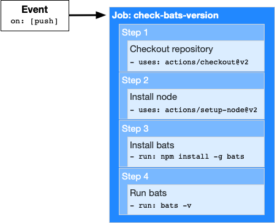
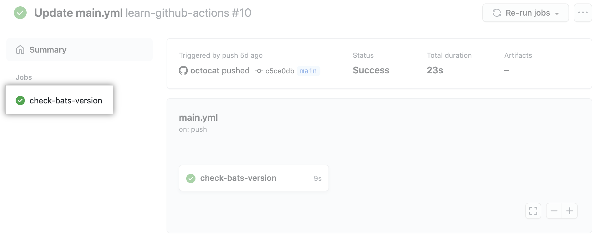

# CI/CD 

## 为什么使用CI/CD

众所周知，前端部署无非就是把打包之后的代码丢到 nginx html 目录下就完事了，但是每逢产品频繁改需求，甚至只是让你改线上一个字的时候，你总要重复一遍遍以下动作：修改，打包，登录服务器，上传代码，重启服务器。周而复始，还没完没了了；别说是你受不了了，搁我旁边看着都受不了。这个时候，有没有想过有个机器人，能帮我们完成以上这些重复又没技术含量的活。没错，你猜对了，可以使用自动化帮助我们完成这些重复的工作。

## 概念介绍

在软件开发的过程中，会经历多次的迭代更新。每次更新，有的是为了修复历史的bug，有的是为了引入新的功能。伴随这这些新的改动，必然也会导致代码的变动，而代码的变动则会导致项目出现bug；或者新代码虽然没有问题，但是代码写的很烂，对未来维护项目带来困难

以前并不是没有CI/CD流程，而是以前的流程是人工的，繁琐的。只要是人工的，每次都必然是不稳定的，都是手工艺品，正如同我们编写代码一样，总是充满着各种问题，并且耗时甚久。

而为了解决上面的问题，我们需要尽量引入自动化工具和流程，为我们减轻审核代码负担，减轻部署项目的时间，以便于更快的交付新功能，修复遗留的bug，并且每次都能稳定的成功部署项目，把软件交付给我们的用户。

## CI 持续集成

集成指的是开发过程中，新代码逐渐通过各种检测合入项目主干的过程。 在这个过程中，一般会做这样一些事情：

- 代码检查(review) 

- 风格检查:

  对代码规范进行检查，看看是不是有长函数，大小写不规范，公开函数不写注释这样的问题。

- 安全扫描:

  检查代码中是否有安全漏洞，比如内存溢出，SQL注入，密钥泄露等风险。

- 功能走查:

  一般是请另一名开发人员检查代码逻辑是否有问题，代码实现方法是否合理。

- 集成测试

测试新代码的程序是否能正常工作，是否和预期一致。

## CD 持续部署

部署就是把编译成功的程序成功交付给用户的过程。网站型软件就是部署到生产服务器，也有客户端软件就是上传到应用商店等。由于这个部分根据不同的项目，公司，环境五花八门，自然也难以统一展示，因此本项目注重于展示上面的CI部分

## Github Action

### 概览

GitHub Actions 帮助您自动完成软件开发周期内的任务。 GitHub Actions 是事件驱动的，意味着您可以在指定事件发生后运行一系列命令。 例如，每次有人为仓库创建拉取请求时，您都可以自动运行命令来执行软件测试脚本。

此示意图说明如何使用 GitHub Actions 自动运行软件测试脚本。 事件会自动触发其中包*作业*的*工作流程*。 然后，作业使用*步骤*来控制*操作*运行的顺序。 这些操作是自动化软件测试的命令。


### GitHub Actions 的组件

下面是一起运行作业的多个 GitHub Actions 组件列表。 您可以查看这些组件如何相互作用。


#### 工作流程

工作流程是您添加到仓库的自动化过程。 工作流程由一项或多项作业组成，可以计划或由事件触发。 工作流程可用于在 GitHub 上构建、测试、打包、发布或部署项目。

#### 事件

事件是触发工作流程的特定活动。 例如，当有推送提交到仓库或者创建议题或拉取请求时，GitHub 就可能产生活动。 您还可以使用[仓库分发 web 挂钩](https://docs.github.com/cn/rest/reference/repos#create-a-repository-dispatch-event)在发生外部事件时触发工作流程。 有关可用于触发工作流程的事件的完整列表，请参阅[触发工作流程的事件](https://docs.github.com/cn/actions/reference/events-that-trigger-workflows)。

#### Jobs

作业是在同一运行服务器上执行的一组步骤。 默认情况下，包含多个作业的工作流程将同时运行这些作业。 您也可以配置工作流程按顺序运行作业。 例如，工作流程可以有两个连续的任务来构建和测试代码，其中测试作业取决于构建作业的状态。 如果构建作业失败，测试作业将不会运行。

#### 步骤

步骤是可以在作业中运行命令的单个任务。 步骤可以是*操作*或 shell 命令。 作业中的每个步骤在同一运行器上执行，可让该作业中的操作互相共享数据。

#### 操作

*操作* 是独立命令，它们组合到*步骤*以创建*作业*。 操作是工作流程最小的便携式构建块。 您可以创建自己的操作，也可以使用 GitHub 社区创建的操作。 要在工作流程中使用操作，必须将其作为一个步骤。

#### 运行器

运行器是安装了 [GitHub Actions 运行器应用程序](https://github.com/actions/runner)的服务器。 您可以使用 GitHub 托管的运行器，也可以托管您自己的运行器。 运行器将侦听可用的作业，每次运行一个作业，并将进度、日志和结果报告回 GitHub。 GitHub 托管的运行器基于 Ubuntu Linux、Microsoft Windows 和 macOS，并且工作流程中的每个作业都在新的虚拟环境中运行。 有关 GitHub 托管的运行器的信息，请参阅“[关于 GitHub 托管的运行器](https://docs.github.com/cn/actions/using-github-hosted-runners/about-github-hosted-runners)”。 如果您需要不同的操作系统或需要特定的硬件配置，可以托管自己的运行器。 有关自托管运行器的信息，请参阅“[托管您自己的运行器](https://docs.github.com/cn/actions/hosting-your-own-runners)”。

### 创建示例工作流程

GitHub Actions 使用 YAML 语法来定义事件、作业和步骤。 这些 YAML 文件存储在代码仓库中名为 `.github/workflows` 的目录中。

您可以在仓库中创建示例工作流程，只要推送代码，该工作流程就会自动触发一系列命令。 在此工作流程中，GitHub Actions 检出推送的代码，安装软件依赖项，并运行 `-v`。

1. 在您的仓库中，创建 `.github/workflows/` 目录来存储工作流程文件。

2. 在`.github/workflows/`目录中，创建一个名为

   ```
   learn-github-actions.yml
   ```

   的新文件并添加以下代码。

   ```yaml
   name: learn-github-actions
   on: [push]
   jobs:
     check-bats-version:
       runs-on: ubuntu-latest
       steps:
         - uses: actions/checkout@v2
         - uses: actions/setup-node@v1
         - run: npm install -g bats
         - run: bats -v
   ```

3. 提交这些更改并将其推送到您的 GitHub 仓库。

您的新 GitHub Actions 工作流程文件现在安装在您的仓库中，每次有人推送更改到仓库时都会自动运行。 有关作业的执行历史记录的详细信息，请参阅“[查看工作流程的活动](https://docs.github.com/cn/actions/learn-github-actions/introduction-to-github-actions#viewing-the-jobs-activity)”。

### [了解工作流程文件](https://docs.github.com/cn/actions/learn-github-actions/introduction-to-github-actions#understanding-the-workflow-file)

为帮助您了解如何使用 YAML 语法来创建工作流程文件，本节解释介绍示例的每一行：

| `name: learn-github-actions`        | *可选* - 将出现在 GitHub 仓库的 Actions（操作）选项卡中的工作流程名称。 |
| ----------------------------------- | ------------------------------------------------------------ |
| `on: [push]`                        | 指定自动触发工作流程文件的事件。 此示例使用 `push` 事件，这样每次有人推送更改到仓库时，作业都会运行。 您可以设置工作流程仅在特定分支、路径或标记上运行。 有关包含或排除分支、路径或标记的语法示例，请参阅[“GitHub Actions 的工作流程语法”](https://docs.github.com/actions/reference/workflow-syntax-for-github-actions#onpushpull_requestpaths)。 |
| `jobs:`                             | 将 `learn-github-actions` 工作流程文件中运行的所有作业组合在一起。 |
| `check-bats-version:`               | 定义存储在 `jobs` 部分的 `check-bats-version` 作业的名称。   |
| `  runs-on: ubuntu-latest`          | 配置作业在 Ubuntu Linux 运行器上运行。 这意味着该作业将在 GitHub 托管的新虚拟机上执行。 有关使用其他运行器的语法示例，请参阅[“GitHub Actions 的工作流程语法”](https://docs.github.com/en/actions/reference/workflow-syntax-for-github-actions#jobsjob_idruns-on)。 |
| `  steps:`                          | 将 `check-bats-version` 作业中运行的所有步骤组合在一起。 此部分下嵌套的每项都是一个单独的操作或 shell 命令。 |
| `    - uses: actions/checkout@v2`   | `uses` 关键字指示作业检索名为 `actions/checkout@v2` 的社区操作的 `v2`。 这是检出仓库并将其下载到运行器的操作，允许针对您的代码运行操作（例如测试工具）。 只要工作流程针对仓库的代码运行，或者您使用仓库中定义的操作，您都必须使用检出操作。 |
| `    - uses: actions/setup-node@v1` | 此操作会在运行器上安装 `node` 软件包，使您可以访问 `npm` 命令。 |
| `    - run: npm install -g bats`    | `run` 关键字指示作业在运行器上执行命令。 在这种情况下，使用 `npm` 来安装 `bats` 软件测试包。 |
| `    - run: bats -v`                | 最后，您将运行 `bats` 命令，并且带有输出软件版本的参数。     |

#### [可视化工作流程文件](https://docs.github.com/cn/actions/learn-github-actions/introduction-to-github-actions#visualizing-the-workflow-file)

在此关系图中，您可以看到刚刚创建的工作流程文件，以及 GitHub Actions 组件在层次结构中的组织方式。 每个步骤执行单个操作或 shell 命令。 步骤 1 和 2 使用预构建的社区操作。 步骤 3 和 4 直接在运行器上运行 shell 命令。 要查找更多为工作流预构建的操作，请参阅“[查找和自定义操作](https://docs.github.com/cn/actions/learn-github-actions/finding-and-customizing-actions)”。



### [查看作业的活动](https://docs.github.com/cn/actions/learn-github-actions/introduction-to-github-actions#viewing-the-jobs-activity)

作业开始运行后，您可以 查看运行进度的可视化图以及查看 GitHub 上每个步骤的活动。

1. 在 GitHub 上，导航到仓库的主页面。
2. 在仓库名称下，单击 **Actions（操作）**。
3. 在左侧边栏中，单击您想要查看的工作流程。
4. 在“Workflow runs（工作流程运行）”下，单击您想要查看的运行的名称。
5. 在 **Jobs（作业）**下或可视化图中，单击您要查看的作业。
6. 查看每个步骤的结果。
